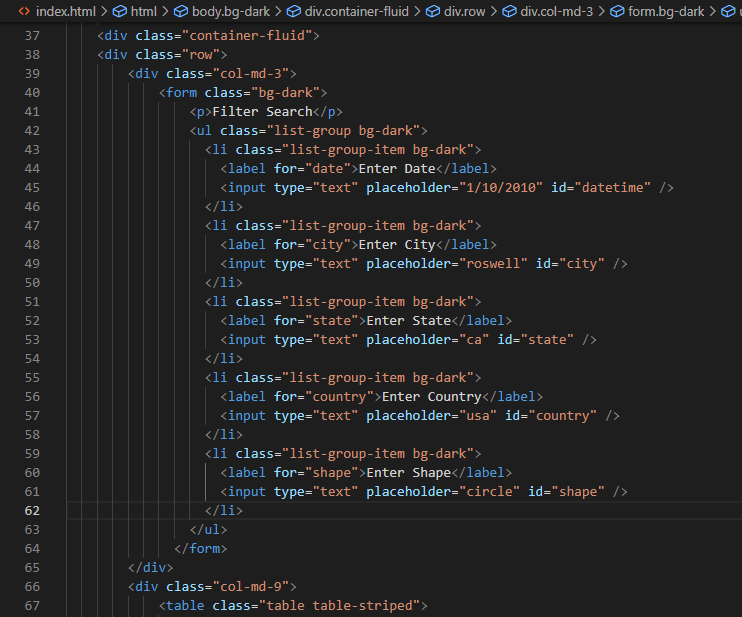
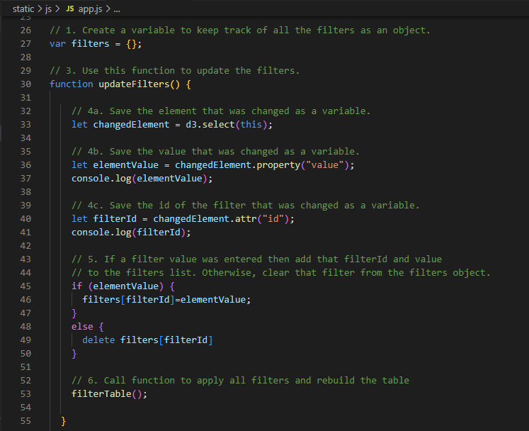
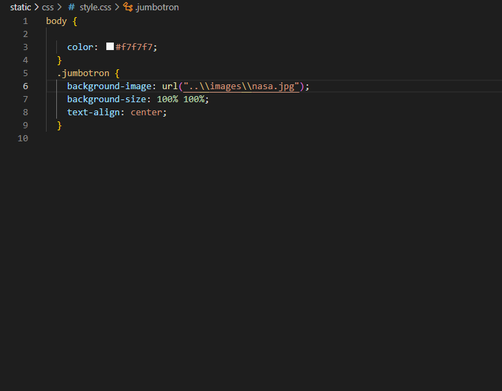

# UFOs

## Deployed to https://cagurr.github.io/UFOs/

## Overview of UFO Analysis

Dana, a data journalist, is given the opportunity to write about her hometown, but it is much more than that.  Minnville, Oregon is famous for its UFO sightings and even has an annual gathering of UFO enthusiasts.  In lieu of writing a traditional article, Data decided to engage me to create a website displaying archived UFO sighting data.  Dana has a javascript file with sighting information (e.g., country, city, state, type of signting, etc.) that we used for our project.  The website that Dana and I created is dynamic and uses javascript to display and filter the final results.
 
### Resources

* Data Source:  app.js, data.js, index.html, style.css
* Software:  Visual Studio Code 1.38.1, JavaScript 

## UFO Search Feature

Dana and I created functions to build the data tables from the javascript file.  We also built the index.html and style.css files to customize the look of our website.  The app.js file was the most involved.  Using d3, we were able to make our website interactive and display updated results upon a button click or filter update.  While this was technical and difficult, running the application was easy.  The paragraph below explains how to open the website and filter the UFO data.

After selecting the index.html file to open the webpage, scroll down to the filter boxes and data table.  The data table is programmed to return all of the data intially.  Once filtering criteria are entered in the fiter boxes, the data table will present the requested data.  In the example below, we filtered the data based on the city "el cajon."

### Pictures of Filtered Results

Table of Filtered UFO Data:

## Summary

### Results

The website looks amazing.  Dana and I are both impressed with the results.  The website is customized with a banner picture and dark background.  The table presents the data cleanly, and the results are filtered quickly.  The project was a success; however, more could be done to improve the website.  The following could be improved:

1.  Drawback:  We only have a little data to present.   

2.  Recommendation #1:  If we had more data, we can do more analyses.  Please add more data to the data set.

3.  Recommendation #2:  We need a way to export the filtered data for further analysis.  While the table format is great, we can only perform limited analyses.

## Code Snippets

index.html File:

app.js File:

style.css File:

