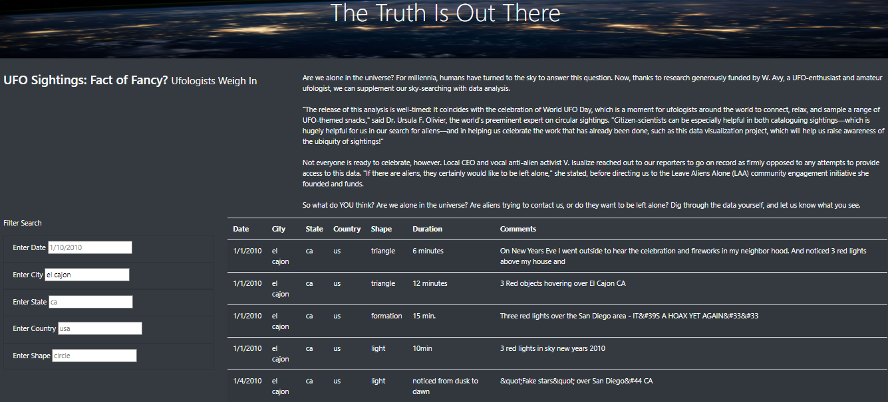

# UFOs

## Overview of UFO Analysis

Dana, a data journalist, is given the opportunity to write about a topic of her choice.  She jumps on it.  This is an opportunity for her to write about her hometown, but it is also an opportunity to write about UFO sightings.  McMinnville, Oregon is famous for its sightings and even has an annual gathering of UFO enthusiasts.  The only source of data Dana has to use is a javascript file with sighting information (e.g., country, city, state, type of signting, etc.)  Dana and I used that data to create a dynamic website using javascript for displying the results.  The displayed results can also be filtered by multiple criteria to view targeted results.     
 
### Resources

* Data Source:  app.js, data.js, index.html, style.css
* Software:  Visual Studio Code 1.38.1, JavaScript 

## UFO Analysis Methdology

To perform this task, Dana and I created functions to build the data tables from the javascript file.  We also built the index.html and style.css files to customize the look of our website.  The app.js file was the most involved.  Using d3, we were able to make our website interactive and display updated results upon a button click or filter update.

## Summary

### Results

The website looks amazing.  Dana and I are both impressed with the results.  The website is customized with a banner picture and dark background.  The table presents the data cleanly, and the results are filtered quickly.  The project was a success!

### Pictures of final results

Table of Filtered UFO Data:

## Code Snippets

index.html File:

app.js File:

style.css File:
